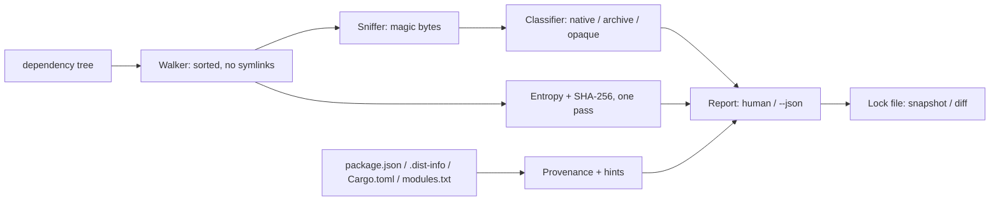

# blobfind

[English](README.md) | [中文](README.zh.md) | [日本語](README.ja.md)

[](LICENSE) [](Cargo.toml)  [](CONTRIBUTING.md)

**依存ツリーに潜むネイティブバイナリ・共有ライブラリ・高エントロピー blob を棚卸しするオープンソースのセンサス（全数調査）ツール——由来ヒント、ロック可能なベースライン、完全オフライン。**


```bash
git clone https://github.com/JaydenCJ/blobfind.git && cargo install --path blobfind
```

> プレリリース版：crates.io 未公開のため、上記のとおりソースからインストールしてください。依存はゼロ——バイナリは std のみで構築。サプライチェーンを調査するツールが自らサプライチェーンを持ってはいけないからです。

## なぜ blobfind？

ソースレビューにはリンカほど大きな盲点があります：ビルド済みバイナリです。`npm install` は `.node` アドオンや prebuild の tar 玉を `node_modules` に落とし、pip の wheel は `.so` 拡張モジュールを運び、vendor 済み crate は事前生成の `.o` を同梱します——そのどれも、誰かがレビューした diff には現れません。マルウェアスキャナはこの穴を塞げません：照合するのは*既知の悪性*ハッシュだけで、新しいインプラントはクリーンに見えますし、`npm audit` 系ツールはアドバイザリ DB を引くだけです。監査人が本当に求めるものはもっと単純で、もっと難しい：ツリー内のすべての実行可能コンテンツの完全な台帳、それを持ち込んだのは誰か、そして前回のインストールから変わっていない証明です。blobfind がそのセンサスです：全ファイルをマジックバイトで嗅ぎ分け（ELF、Mach-O、PE、wasm、class ファイル、静的ライブラリ、アーカイブ）、正体不明の高エントロピー blob に印を付け、パッケージマネージャが既にディスクへ書いているメタデータから各検出を所属パッケージに帰属させ、結果を git で diff できるロックファイルに凍結します——ドリフトを「後から気づく事故」ではなく CI の失敗にするために。

|  | blobfind | ハッシュ照合スキャナ¹ | npm audit / pip-audit | binwalk |
|---|---|---|---|---|
| *未知の*バイナリを発見（シグネチャ不要） | はい | いいえ——既知の悪性のみ | いいえ——アドバイザリのみ | はい |
| 由来の帰属（どのパッケージが持ち込んだか） | はい | いいえ | いいえ（ファイル単位の視点なし） | いいえ |
| エコシステム横断（npm、pip、cargo、go、gem） | はい | 対象外 | 各ツール 1 つずつ | 対象外 |
| 高エントロピー blob の検出 | はい | いいえ | いいえ | 部分的（抽出が主目的） |
| ロック可能なベースライン + ドリフト比較 | はい | いいえ | いいえ | いいえ |
| 完全オフラインで動作 | はい | シグネチャ更新が必要 | アドバイザリ DB が必要 | はい |
| ランタイム依存 | ゼロ | 多数 | 多数 | 多数 |

<sub>¹ ClamAV 型およびハッシュリスト型のサプライチェーンスキャナ。答えるのは「このファイルは既知の悪性か？」であり、blobfind が答えるのは「そもそもここにどんな実行可能コンテンツがあり、それは変わったか？」です。各ツールのドキュメントで確認、2026-07。</sub>

## 特長

- **監査人が本当に求めるセンサス** —— 1 回のスキャンでツリー内のすべての ELF、Mach-O（thin + universal）、PE/DLL、WebAssembly モジュール、Java class、静的ライブラリ、バイナリを忍ばせがちなアーカイブを棚卸しし、各件に形式・アーキテクチャ・サイズ・エントロピー・SHA-256 を付与。
- **パスだけでなく由来を** —— パッケージマネージャが既に書いているメタデータ（package.json、`.dist-info`、Cargo.toml、`vendor/modules.txt`、gem のレイアウト）を読み、検出を `npm · sharp@0.33.4`、`pip · numpy@1.26.4`、`cargo · ring@0.17.8` などに帰属——ツールチェーンのインストールは不要。
- **node-gyp のサプライズを可視化** —— blob が*なぜ*そこにあるのかをヒントで説明：インストール時の `build/Release` 生成物、同梱の `prebuilds/`、コンパイル済み Python 拡張、事前生成の `.o`、後からバイナリを展開する同梱 tar 玉。
- **高エントロピー blob に印を** —— 形式不明かつ ≥7.5 bits/byte（調整可）のファイルは `opaque` として報告：パック・暗号化・圧縮されたデータは、どんなソースレビューでも読めません。マジックバイトは常に拡張子に勝つので、`logo.png` に改名された ELF も捕まります。
- **ロック可能なベースライン** —— `blobfind snapshot` はソート済みで git diff 可能なロックファイルを書き出し、インストールの合間にバイナリが現れる・消える・ハッシュが変わるやいなや `blobfind diff` が終了コード 1 で報告。`--strict` は「バイナリ全面禁止」ポリシー向け。
- **オフライン・読み取り専用・決定的** —— ネットワークなし、テレメトリなし、シンボリックリンクは決して辿らず、同一ツリーはバイト単位で同一のレポートを生成。ランタイム依存ゼロ。

## クイックスタート

インストール（Rust 1.75 以上が必要）：

```bash
git clone https://github.com/JaydenCJ/blobfind.git && cargo install --path blobfind
```

プロジェクトツリーのセンサスを取る：

```bash
blobfind scan .
```

出力（同梱 fixture の実行結果をそのまま採取——`bash examples/fixture.sh`）：

```text
cargo · ring@0.17.8 — 1 finding
  KIND   FORMAT                 ARCH            SIZE ENTROPY PATH
  native ELF relocatable object x86-64 (64-bit) 256B 0.31    pregenerated/aesni-x86_64-elf.o

npm · leveldown — 1 finding
  KIND    FORMAT    ARCH SIZE ENTROPY PATH
  archive gzip data -    36B  4.14    prebuilds/linux-x64.tar.gz

npm · sharp@0.33.4 — 1 finding
  KIND   FORMAT            ARCH            SIZE ENTROPY PATH
  native ELF shared object x86-64 (64-bit) 256B 0.32    build/Release/sharp.node

pip · numpy@1.26.4 — 1 finding
  KIND   FORMAT            ARCH            SIZE ENTROPY PATH
  native ELF shared object x86-64 (64-bit) 256B 0.32    core/_multiarray_umath.cpython-312-x86_64-linux-gnu.so

unattributed — 2 findings
  KIND   FORMAT                  ARCH SIZE ENTROPY PATH
  native WebAssembly module (v1) -    8B   2.00    assets/filters.wasm
  opaque high-entropy data       -    8.0K 7.98    assets/telemetry.bin

summary: 9 files scanned · 4 native · 1 archive · 1 opaque blob · 4 packages affected
```

センサスを凍結し、次のインストール後に何も変わっていないことを証明する：

```bash
blobfind snapshot . -o blobfind.lock
blobfind diff .          # 終了コード 0：「baseline OK」、ドリフトがあれば 1
blobfind explain node_modules/sharp/build/Release/sharp.node
```

## 何が検出されるか

各ファイルは先頭 512 バイトのマジックバイトで嗅ぎ分けます。検出で拡張子を信用することはなく、拡張子は後述のメディア除外にのみ使われます。

| 種別 | トリガー | 典型例 |
|---|---|---|
| `native` | ELF、Mach-O（thin/universal）、PE/COFF、WebAssembly、Java class、`ar` 静的ライブラリ | `.node` アドオン、`.so`/`.dylib`/`.dll`、`.wasm`、vendor 済み `.o`/`.a` |
| `archive` | zip、gzip、xz、zstd、bzip2、tar のマジック | prebuild の tar 玉、同梱の jar/wheel（拡張子でヒント付与） |
| `opaque` | 既知形式なし、エントロピー ≥ しきい値、サイズ ≥ `--min-blob` | パック/暗号化ペイロード、素性不明の `.bin`/`.dat` |

メディア・フォント拡張子（png、jpg、woff2、ttf、mp4、pdf など）は `opaque` 分類からのみ除外——認識されたバイナリマジックが常に優先し、`--all` で除外を解除できます。

## オプションと終了コード

| キー | 既定値 | 効果 |
|---|---|---|
| `--entropy <BITS>` | `7.5` | 形式不明データを `opaque` と数える bits/byte のしきい値 |
| `--min-blob <SIZE>` | `4K` | `opaque` 検出の最小サイズ（`K`/`M`/`G` 接尾辞可） |
| `--all` | off | メディア/フォント拡張子も `opaque` 分類の対象にする |
| `--no-archives` | off | `archive` 検出をセンサスから除外する |
| `--json` | off | 機械可読出力（`scan`、`explain`） |
| `--strict` | off | 検出が 1 件でもあれば `scan` を終了コード 1 で終える |
| `-o, --output <FILE>` | 標準出力 | `snapshot` がロックファイルを書く場所 |
| `--against <FILE>` | `<DIR>/blobfind.lock` | `diff` がツリーと比較するベースライン |
| `--root <DIR>` | カレントディレクトリ | `explain` が由来を解決する際の検索ルート |

終了コード：`0` クリーン、`1` `--strict` 下の検出またはベースラインのドリフト、`2` 用法エラー。ロックファイルは blob ごとに `sha256 size kind path` の 1 行、パス順にソート——他の lockfile と同様にコミットしてレビューできる設計です（[docs/lock-format.md](docs/lock-format.md) を参照）。

## アーキテクチャ



## ロードマップ

- [x] コアセンサス：ELF/Mach-O/PE/wasm/class/ar の嗅ぎ分け、エントロピー分類、npm/pip/cargo/go/gem の由来帰属とヒント、JSON 出力、ロックファイルの snapshot + ドリフト diff、strict 終了コード
- [ ] アーカイブの中へ：zip/tar のメンバーを列挙し、入れ子のバイナリをその場で分類
- [ ] ネイティブ詳細の深掘り：動的ライブラリのインポート（`DT_NEEDED`）、strip の有無、リンクされた libc
- [ ] SBOM エクスポート（CycloneDX）——センサスをファイル単位のエビデンスとして添付
- [ ] Windows ネイティブ対応：`\\?` パス、PE 中心のツリー、大文字小文字を区別しない拡張子処理

全リストは [open issues](https://github.com/JaydenCJ/blobfind/issues) を参照してください。

## コントリビュート

コントリビュート歓迎です——[CONTRIBUTING.md](CONTRIBUTING.md) を読み、[good first issue](https://github.com/JaydenCJ/blobfind/issues?q=is%3Aissue+is%3Aopen+label%3A%22good+first+issue%22) から始めるか、[discussion](https://github.com/JaydenCJ/blobfind/discussions) を開いてください。

## ライセンス

[MIT](LICENSE)
