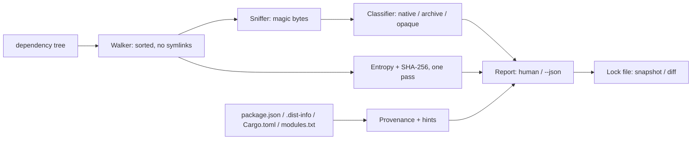

# blobfind

[English](README.md) | [中文](README.zh.md) | [日本語](README.ja.md)

[](LICENSE) [](Cargo.toml)  [](CONTRIBUTING.md)

**Open-source census of native binaries, shared libraries and high-entropy blobs hiding inside dependency trees — provenance hints, lockable baselines, fully offline.**


```bash
git clone https://github.com/JaydenCJ/blobfind.git && cargo install --path blobfind
```

> Pre-release: not yet on crates.io; install from source as above. Zero dependencies — the binary is std-only, because a supply-chain census tool must not have a supply chain of its own.

## Why blobfind?

Source review has a blind spot the size of a linker: precompiled binaries. `npm install` drops `.node` addons and prebuild tarballs into `node_modules`, pip wheels carry `.so` extension modules, vendored crates ship pregenerated `.o` files — and none of that content is in the diff anyone reviewed. Malware scanners don't close the gap: they match *known-bad* hashes, so a fresh implant hashes clean, and `npm audit`-style tools only read advisory databases. What auditors actually ask for is simpler and harder: a complete inventory of every piece of executable content in the tree, who shipped it, and proof it hasn't changed since the last install. blobfind is that census: it sniffs every file by magic bytes (ELF, Mach-O, PE, wasm, class files, static libs, archives), flags unrecognized high-entropy blobs, attributes each finding to its owning package from the metadata package managers already write, and freezes the result into a git-diffable lock file so drift is a CI failure, not a surprise.

|  | blobfind | hash-matching scanners¹ | npm audit / pip-audit | binwalk |
|---|---|---|---|---|
| Finds *unknown* binaries (no signature needed) | yes | no — known-bad only | no — advisories only | yes |
| Provenance (which package shipped it) | yes | no | no (no file-level view) | no |
| Cross-ecosystem (npm, pip, cargo, go, gem) | yes | n/a | one ecosystem each | n/a |
| High-entropy blob detection | yes | no | no | partial (extraction focus) |
| Lockable baseline + drift diff | yes | no | no | no |
| Works fully offline | yes | needs signature updates | needs advisory DB | yes |
| Runtime dependencies | zero | many | many | many |

<sub>¹ ClamAV-style and hash-list supply-chain scanners. They answer "is this file already known to be malicious?"; blobfind answers "what executable content is here at all, and did it change?". Verified against tool docs, 2026-07.</sub>

## Features

- **The census auditors actually ask for** — one pass inventories every ELF, Mach-O (thin + universal), PE/DLL, WebAssembly module, Java class, static library and binary-smuggling archive in the tree, each with format, architecture, size, entropy and SHA-256.
- **Provenance, not just paths** — findings are attributed to `npm · sharp@0.33.4`, `pip · numpy@1.26.4`, `cargo · ring@0.17.8` and friends by reading the metadata package managers already write (package.json, `.dist-info`, Cargo.toml, `vendor/modules.txt`, gem layouts) — no toolchains needed.
- **node-gyp surprises surfaced** — hints explain *why* a blob is probably there: install-time `build/Release` output, shipped `prebuilds/`, compiled Python extensions, pregenerated `.o` files, bundled tarballs that unpack binaries later.
- **High-entropy blobs flagged** — unrecognized files at ≥7.5 bits/byte (tunable) are reported as `opaque`: packed, encrypted or compressed data that no source review can read. Magic bytes always beat extensions, so an ELF renamed `logo.png` is still caught.
- **Lockable baseline** — `blobfind snapshot` writes a sorted, git-diffable lock file; `blobfind diff` exits 1 the moment a binary appears, vanishes or changes hash between installs. `--strict` does the same for "no binaries allowed at all" policies.
- **Offline, read-only, deterministic** — no network, no telemetry, symlinks never followed, identical trees produce byte-identical reports. Zero runtime dependencies.

## Quickstart

Install (requires Rust 1.75+):

```bash
git clone https://github.com/JaydenCJ/blobfind.git && cargo install --path blobfind
```

Take the census of a project tree:

```bash
blobfind scan .
```

Output (captured from the bundled fixture — `bash examples/fixture.sh`):

```text
cargo · ring@0.17.8 — 1 finding
  KIND   FORMAT                 ARCH            SIZE ENTROPY PATH
  native ELF relocatable object x86-64 (64-bit) 256B 0.31    pregenerated/aesni-x86_64-elf.o

npm · leveldown — 1 finding
  KIND    FORMAT    ARCH SIZE ENTROPY PATH
  archive gzip data -    36B  4.14    prebuilds/linux-x64.tar.gz

npm · sharp@0.33.4 — 1 finding
  KIND   FORMAT            ARCH            SIZE ENTROPY PATH
  native ELF shared object x86-64 (64-bit) 256B 0.32    build/Release/sharp.node

pip · numpy@1.26.4 — 1 finding
  KIND   FORMAT            ARCH            SIZE ENTROPY PATH
  native ELF shared object x86-64 (64-bit) 256B 0.32    core/_multiarray_umath.cpython-312-x86_64-linux-gnu.so

unattributed — 2 findings
  KIND   FORMAT                  ARCH SIZE ENTROPY PATH
  native WebAssembly module (v1) -    8B   2.00    assets/filters.wasm
  opaque high-entropy data       -    8.0K 7.98    assets/telemetry.bin

summary: 9 files scanned · 4 native · 1 archive · 1 opaque blob · 4 packages affected
```

Freeze the census, then prove nothing changed after the next install:

```bash
blobfind snapshot . -o blobfind.lock
blobfind diff .          # exit 0: "baseline OK", exit 1 on any drift
blobfind explain node_modules/sharp/build/Release/sharp.node
```

## What gets flagged

Every file is sniffed by magic bytes from its first 512 bytes; extensions are never trusted for detection, only for the media exemption below.

| Kind | Triggered by | Typical examples |
|---|---|---|
| `native` | ELF, Mach-O (thin/universal), PE/COFF, WebAssembly, Java class, `ar` static library | `.node` addons, `.so`/`.dylib`/`.dll`, `.wasm`, vendored `.o`/`.a` |
| `archive` | zip, gzip, xz, zstd, bzip2, tar magic | prebuild tarballs, bundled jars/wheels (hinted by extension) |
| `opaque` | no known format, entropy ≥ threshold, size ≥ `--min-blob` | packed/encrypted payloads, mystery `.bin`/`.dat` files |

Media and font extensions (png, jpg, woff2, ttf, mp4, pdf, …) are exempt from `opaque` classification only — a recognized binary magic always wins, and `--all` removes the exemption.

## Options and exit codes

| Key | Default | Effect |
|---|---|---|
| `--entropy <BITS>` | `7.5` | Bits/byte at or above which unrecognized data counts as `opaque` |
| `--min-blob <SIZE>` | `4K` | Minimum size for `opaque` findings (`K`/`M`/`G` suffixes) |
| `--all` | off | Consider media/font extensions for `opaque` classification too |
| `--no-archives` | off | Drop `archive` findings from the census |
| `--json` | off | Machine-readable output (`scan`, `explain`) |
| `--strict` | off | `scan` exits 1 when there is any finding at all |
| `-o, --output <FILE>` | stdout | Where `snapshot` writes the lock file |
| `--against <FILE>` | `<DIR>/blobfind.lock` | Baseline that `diff` compares the tree to |
| `--root <DIR>` | current directory | Search root `explain` uses to resolve provenance |

Exit codes: `0` clean, `1` findings under `--strict` or baseline drift, `2` usage error. The lock file is one `sha256 size kind path` line per blob, sorted — designed to be committed and reviewed like any other lockfile (see [docs/lock-format.md](docs/lock-format.md)).

## Architecture



## Roadmap

- [x] Core census: ELF/Mach-O/PE/wasm/class/ar sniffing, entropy classification, npm/pip/cargo/go/gem provenance with hints, JSON output, lock-file snapshot + drift diff, strict exit codes
- [ ] Look inside archives: enumerate zip/tar members and classify nested binaries in place
- [ ] Deeper native detail: dynamic-library imports (`DT_NEEDED`), stripped status, linked libc
- [ ] SBOM export (CycloneDX) with the census attached as file-level evidence
- [ ] Windows-native runs: `\\?` paths, PE-heavy trees, case-insensitive extension handling

See the [open issues](https://github.com/JaydenCJ/blobfind/issues) for the full list.

## Contributing

Contributions are welcome — see [CONTRIBUTING.md](CONTRIBUTING.md), start with a [good first issue](https://github.com/JaydenCJ/blobfind/issues?q=is%3Aissue+is%3Aopen+label%3A%22good+first+issue%22) or open a [discussion](https://github.com/JaydenCJ/blobfind/discussions).

## License

[MIT](LICENSE)
