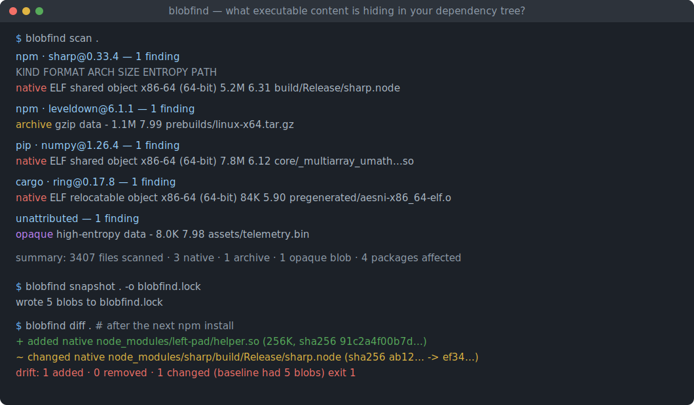
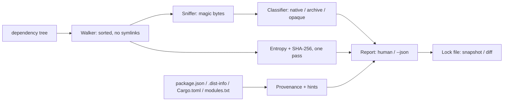

# blobfind

[English](README.md) | [中文](README.zh.md) | [日本語](README.ja.md)

[](LICENSE) [](Cargo.toml)  [](CONTRIBUTING.md)

**开源的依赖树可执行内容普查工具：清点藏在依赖树里的原生二进制、共享库与高熵 blob——附带来源提示、可锁定的基线，完全离线。**



```bash
git clone https://github.com/JaydenCJ/blobfind.git && cargo install --path blobfind
```

> 预发布版：尚未上架 crates.io，请按上述方式从源码安装。零依赖——二进制仅用 std 构建，因为供应链普查工具自己绝不能再引入一条供应链。

## 为什么选 blobfind？

源码审查有一个和链接器一样大的盲区：预编译二进制。`npm install` 会把 `.node` 插件和 prebuild 压缩包丢进 `node_modules`，pip 的 wheel 携带 `.so` 扩展模块，vendored 的 crate 附带预生成的 `.o` 文件——而这些内容从不出现在任何人审过的 diff 里。杀毒式扫描器补不上这个缺口：它们只匹配*已知恶意*的哈希，新植入的后门哈希完全干净；`npm audit` 一类工具也只是查询公告数据库。审计人员真正要的东西更简单也更难：树里每一份可执行内容的完整清单、它是谁带进来的、以及自上次安装以来它没有变化的证明。blobfind 就是这份普查：按魔数嗅探每个文件（ELF、Mach-O、PE、wasm、class 文件、静态库、归档），标记无法识别的高熵 blob，利用包管理器本来就写在磁盘上的元数据把每条发现归属到所属的包，并把结果冻结成可被 git diff 的锁文件——让漂移变成 CI 失败，而不是事后惊吓。

|  | blobfind | 哈希匹配扫描器¹ | npm audit / pip-audit | binwalk |
|---|---|---|---|---|
| 发现*未知*二进制（无需特征库） | 是 | 否——只认已知恶意 | 否——只查公告 | 是 |
| 来源归属（哪个包带进来的） | 是 | 否 | 否（没有文件级视角） | 否 |
| 跨生态（npm、pip、cargo、go、gem） | 是 | 不适用 | 各管一个生态 | 不适用 |
| 高熵 blob 检测 | 是 | 否 | 否 | 部分（侧重提取） |
| 可锁定基线 + 漂移对比 | 是 | 否 | 否 | 否 |
| 完全离线可用 | 是 | 需更新特征库 | 需公告数据库 | 是 |
| 运行时依赖 | 零 | 很多 | 很多 | 很多 |

<sub>¹ ClamAV 式及哈希清单类供应链扫描器。它们回答"这个文件是否已知是恶意的？"；blobfind 回答"这里到底有哪些可执行内容，它变了没有？"。依据各工具文档核实，2026-07。</sub>

## 功能特性

- **审计人员真正要的那份普查** —— 一次扫描清点树中每个 ELF、Mach-O（thin + universal）、PE/DLL、WebAssembly 模块、Java class、静态库以及可能夹带二进制的归档，每条都带格式、架构、大小、熵值与 SHA-256。
- **给出来源，而不只是路径** —— 通过读取包管理器本来就写好的元数据（package.json、`.dist-info`、Cargo.toml、`vendor/modules.txt`、gem 目录布局），把发现归属到 `npm · sharp@0.33.4`、`pip · numpy@1.26.4`、`cargo · ring@0.17.8` 等——不需要装任何工具链。
- **node-gyp 的意外无处可藏** —— 提示会解释一个 blob *为什么*大概率在那里：安装时生成的 `build/Release` 产物、随包发行的 `prebuilds/`、编译好的 Python 扩展、预生成的 `.o` 文件、日后才解包出二进制的捆绑压缩包。
- **高熵 blob 全部标记** —— 无法识别且熵 ≥7.5 bits/byte（可调）的文件报告为 `opaque`：打包、加密或压缩的数据，任何源码审查都读不了。魔数永远优先于扩展名，改名成 `logo.png` 的 ELF 照样被抓。
- **可锁定的基线** —— `blobfind snapshot` 写出排序好、可被 git diff 的锁文件；两次安装之间只要有二进制出现、消失或哈希变化，`blobfind diff` 立刻以退出码 1 报告。`--strict` 则服务于"完全禁止二进制"的策略。
- **离线、只读、确定性** —— 无网络、无遥测、从不跟随符号链接，相同的树产出字节级一致的报告。零运行时依赖。

## 快速上手

安装（需要 Rust 1.75+）：

```bash
git clone https://github.com/JaydenCJ/blobfind.git && cargo install --path blobfind
```

对项目树做一次普查：

```bash
blobfind scan .
```

输出（取自随附 fixture 的真实运行——`bash examples/fixture.sh`）：

```text
cargo · ring@0.17.8 — 1 finding
  KIND   FORMAT                 ARCH            SIZE ENTROPY PATH
  native ELF relocatable object x86-64 (64-bit) 256B 0.31    pregenerated/aesni-x86_64-elf.o

npm · leveldown — 1 finding
  KIND    FORMAT    ARCH SIZE ENTROPY PATH
  archive gzip data -    36B  4.14    prebuilds/linux-x64.tar.gz

npm · sharp@0.33.4 — 1 finding
  KIND   FORMAT            ARCH            SIZE ENTROPY PATH
  native ELF shared object x86-64 (64-bit) 256B 0.32    build/Release/sharp.node

pip · numpy@1.26.4 — 1 finding
  KIND   FORMAT            ARCH            SIZE ENTROPY PATH
  native ELF shared object x86-64 (64-bit) 256B 0.32    core/_multiarray_umath.cpython-312-x86_64-linux-gnu.so

unattributed — 2 findings
  KIND   FORMAT                  ARCH SIZE ENTROPY PATH
  native WebAssembly module (v1) -    8B   2.00    assets/filters.wasm
  opaque high-entropy data       -    8.0K 7.98    assets/telemetry.bin

summary: 9 files scanned · 4 native · 1 archive · 1 opaque blob · 4 packages affected
```

冻结这份普查，然后在下次安装后证明什么都没变：

```bash
blobfind snapshot . -o blobfind.lock
blobfind diff .          # 退出码 0："baseline OK"；有任何漂移则退出码 1
blobfind explain node_modules/sharp/build/Release/sharp.node
```

## 哪些内容会被标记

每个文件都按其前 512 字节的魔数嗅探；检测从不信任扩展名，扩展名只用于下述媒体豁免。

| 类别 | 触发条件 | 典型例子 |
|---|---|---|
| `native` | ELF、Mach-O（thin/universal）、PE/COFF、WebAssembly、Java class、`ar` 静态库 | `.node` 插件、`.so`/`.dylib`/`.dll`、`.wasm`、vendored 的 `.o`/`.a` |
| `archive` | zip、gzip、xz、zstd、bzip2、tar 魔数 | prebuild 压缩包、捆绑的 jar/wheel（按扩展名给出提示） |
| `opaque` | 无已知格式、熵 ≥ 阈值、大小 ≥ `--min-blob` | 打包/加密的载荷、来历不明的 `.bin`/`.dat` 文件 |

媒体与字体扩展名（png、jpg、woff2、ttf、mp4、pdf 等）仅豁免于 `opaque` 分类——识别出的二进制魔数永远优先，`--all` 可取消该豁免。

## 选项与退出码

| 键 | 默认值 | 作用 |
|---|---|---|
| `--entropy <BITS>` | `7.5` | 无法识别的数据达到该 bits/byte 及以上时计为 `opaque` |
| `--min-blob <SIZE>` | `4K` | `opaque` 发现的最小体积（支持 `K`/`M`/`G` 后缀） |
| `--all` | 关 | 媒体/字体扩展名也参与 `opaque` 分类 |
| `--no-archives` | 关 | 从普查中去掉 `archive` 类发现 |
| `--json` | 关 | 机器可读输出（`scan`、`explain`） |
| `--strict` | 关 | 只要有任何发现，`scan` 即以退出码 1 结束 |
| `-o, --output <FILE>` | 标准输出 | `snapshot` 写锁文件的位置 |
| `--against <FILE>` | `<DIR>/blobfind.lock` | `diff` 用来对照当前树的基线 |
| `--root <DIR>` | 当前目录 | `explain` 解析来源归属时使用的搜索根目录 |

退出码：`0` 干净，`1` `--strict` 下有发现或基线漂移，`2` 用法错误。锁文件每个 blob 一行 `sha256 size kind path`，按路径排序——设计为像其他 lockfile 一样提交和评审（见 [docs/lock-format.md](docs/lock-format.md)）。

## 架构



## 路线图

- [x] 核心普查：ELF/Mach-O/PE/wasm/class/ar 嗅探、熵分类、npm/pip/cargo/go/gem 来源归属与提示、JSON 输出、锁文件 snapshot + 漂移 diff、strict 退出码
- [ ] 深入归档内部：枚举 zip/tar 成员并就地分类嵌套的二进制
- [ ] 更深的原生细节：动态库导入（`DT_NEEDED`）、是否 strip、链接的 libc
- [ ] SBOM 导出（CycloneDX），把普查作为文件级证据附上
- [ ] Windows 原生运行：`\\?` 路径、以 PE 为主的树、大小写不敏感的扩展名处理

完整列表见 [open issues](https://github.com/JaydenCJ/blobfind/issues)。

## 参与贡献

欢迎贡献——请阅读 [CONTRIBUTING.md](CONTRIBUTING.md)，从一个 [good first issue](https://github.com/JaydenCJ/blobfind/issues?q=is%3Aissue+is%3Aopen+label%3A%22good+first+issue%22) 开始，或发起一个 [discussion](https://github.com/JaydenCJ/blobfind/discussions)。

## 许可证

[MIT](LICENSE)
